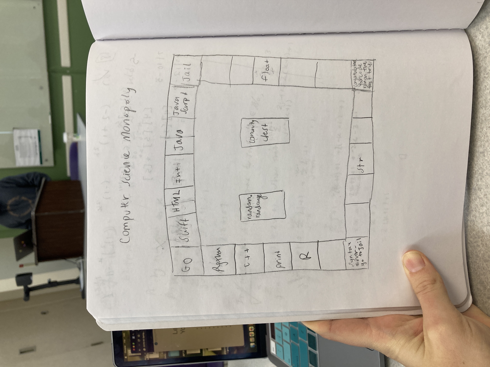
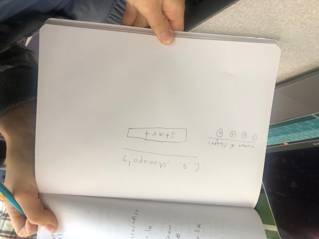
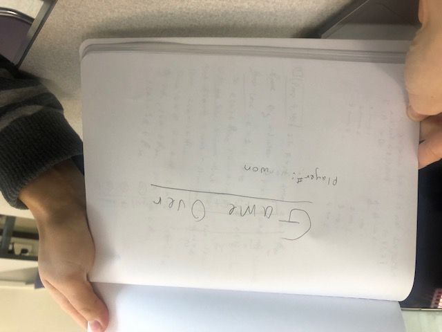
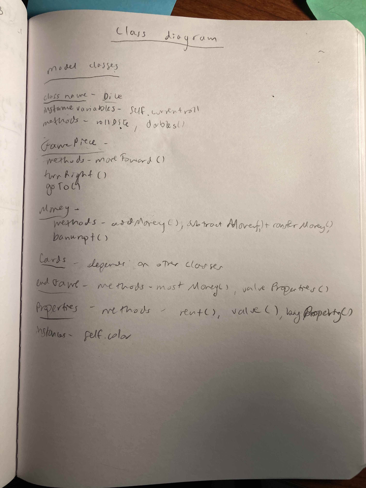

:warning: Everything between << >> needs to be replaced (remove << >> after replacing)
# CS110 Project Proposal
# << Project Title >>
## CS 110 Final Project
### << Semester, Year >>
### [Assignment Description](https://docs.google.com/document/d/1H4R6yLL7som1lglyXWZ04RvTp_RvRFCCBn6sqv-82ps/edit#)

<< [repl](#) >>

<< [link to demo presentation slides](#) >>

### Team: The Mathletes
####  Ryan Renda, Lauren Stiefel, Aviva Friedman 

***

## Project Description *(Software Lead)*

<< Give an overview of your project >>

***    

## User Interface Design *(Front End Specialist)*

* << A wireframe or drawing of the user interface concept along with a short description of the interface. You should have one for each screen in your program. >>
    * For example, if your program has a start screen, game screen, and game over screen, you should include a wireframe / screenshot / drawing of each one and a short description of the components
    * 
      * monopoly game board
    * 
      * start screen - choose the number of players and press start
    * 
      * game over screen - tells you who won the game
* << You should also have a screenshot of each screen for your final GUI >>

***        

## Program Design *(Backend Specialist)*

* Non-Standard libraries
    * << You should have a list of any additional libraries or modules used (pygame, request) beyond non-standard python. >>
    * For each additional module you should include
        * url for the module documentation
        * a short description of the module
* Class Interface Design
    * << A simple drawing that shows the class relationships in your code (see below for an example). >>
        *  
    * This does not need to be overly detailed, but should show how your code fits into the Model/View/Controller paradigm.
* Classes
    * << You should have a list of each of your classes with a description. >>
    * dice - self.currentRoll, rollDice(), doubles()
    * gamePiece - moveForward(), turnRight(), goTo()
    * money- addMoney(), subtractMoney(), transferMoney(), bankrupt()
    * cards - Calls methods from other classes
    * endGame - mostMoney(), valueProperties()
    * Properties- rent(), valuePropertes(), self.color, buyProperties()
## Project Structure *(Software Lead)*

The Project is broken down into the following file structure:

* main.py
* src
    * <all of your python files should go here>
* assets
    * <all of your media, i.e. images, font files, etc, should go here)
* etc
    * <This is a catch all folder for things that are not part of your project, but you want to keep with your project. Your demo video should go here.>

***

## Tasks and Responsibilities *(Software Lead)*

   * You must outline the team member roles and who was responsible for each class/method, both individual and collaborative.

### Software Lead - << name >>

<< Worked as integration specialist by... >>

### Front End Specialist - << name >>

<< Front-end lead conducted significant research on... >>

### Back End Specialist - << name >>

<< The back end specialist... >>

## Testing *(Software Lead)*

* << Describe your testing strategy for your project. >>
    * << Example >>

## ATP

| Step                  | Procedure     | Expected Results  | Actual Results |
| ----------------------|:-------------:| -----------------:| -------------- |
|  1  | Click Run Button  | Screen appears with "computer science monopoly" and game instructions  |          |
|  2  | press 'q' key  | program ends 
|  3  | press 'spacebar'  | screen changes to monopoly board  |          |
|  4  | press on the picture of a die  |  player 1 - (shoe picture) jumps foward between 1 and six spaces
#fix steps!
|  5  | if the property is unowned  | button appears asking if you want to buy it with yes or no  |          |
|  6  | press yes  | value of the property is subtracted from your money, button disappears  |          |
|  7  | press no  | button disappears  |          |
|  8  | if property is owned by the other player| the rent of the property is subtracted from your money and added to the other player's money  |          |
|  9  | if they land on go  | their money increases by $200 |          |
|  10  | if they land on commnunity chest  | money increases or decreases by a random number from -50 to 50  |          |
|  11  | if they land on chance  | player is teleported to a random space on the board  |          |
|  12  | if they land on go to jail|  $50 is subtracted from their money and they move to just visiting space |          |
|  13  | if they land on free parking  | nothing happens  |          |
|  14  | if they land on just visiting  |  nothing happens |          |
|  15  | start the next player's turn by pressing the die picture  |   |          |
|  16  | 'q' is pressed  |  game over screen appears with the player that won (player with the most money) and the amount of money they have |          |
|  17  | a player has 0 or less money  |  game over screen appears with the player that won (player with the most money) and the amount of money they have |          |
|  18  |  |   |          |
v
|                 |
etc...

sources:
how to make a button: https://pythonprogramming.altervista.org/buttons-in-pygame/
