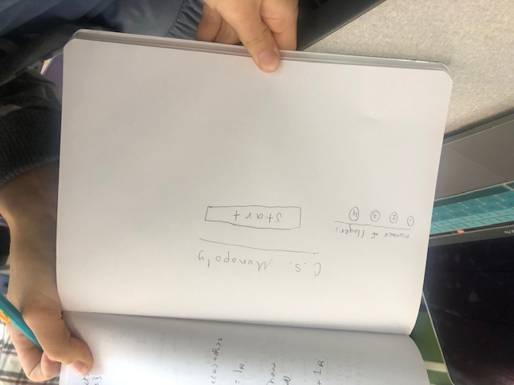
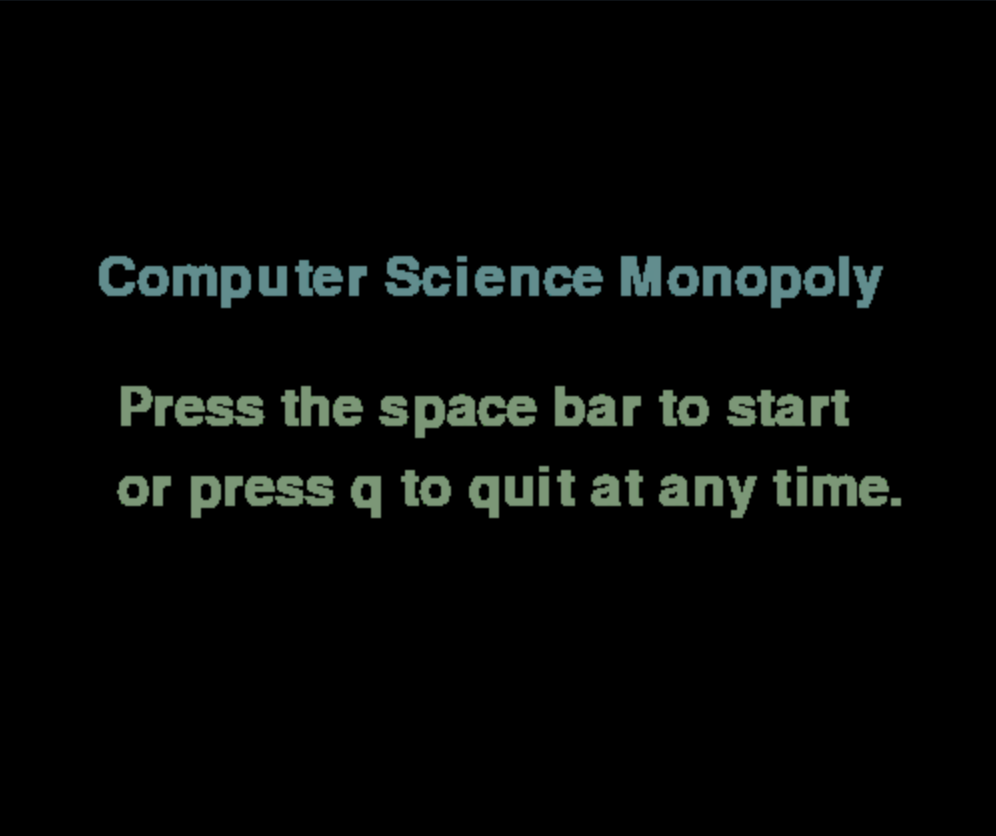
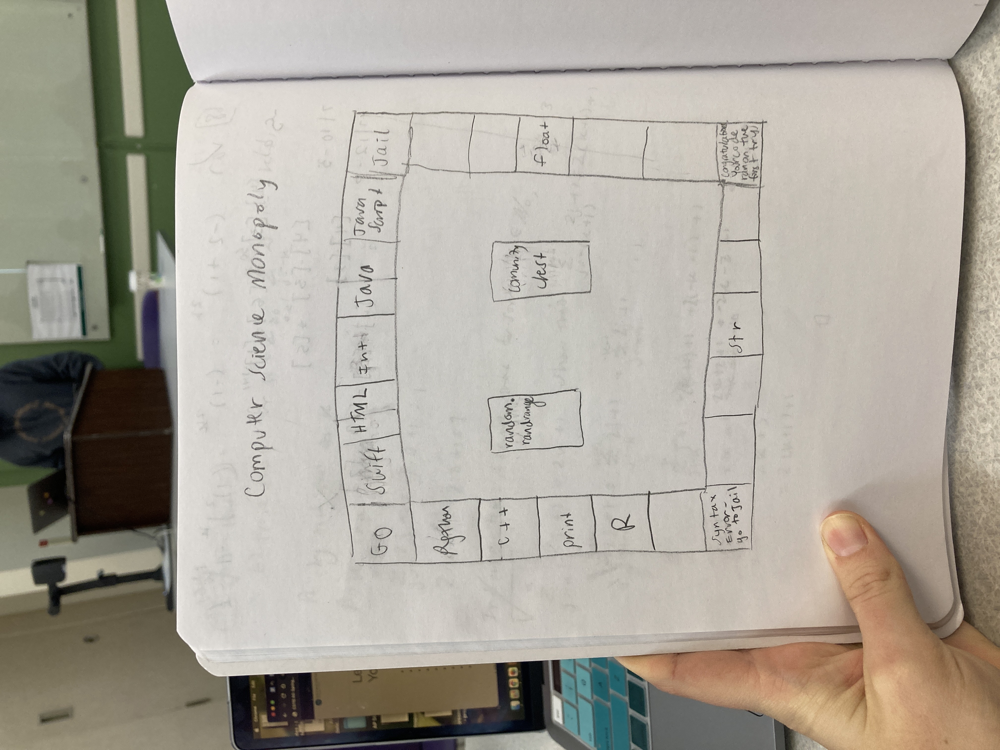
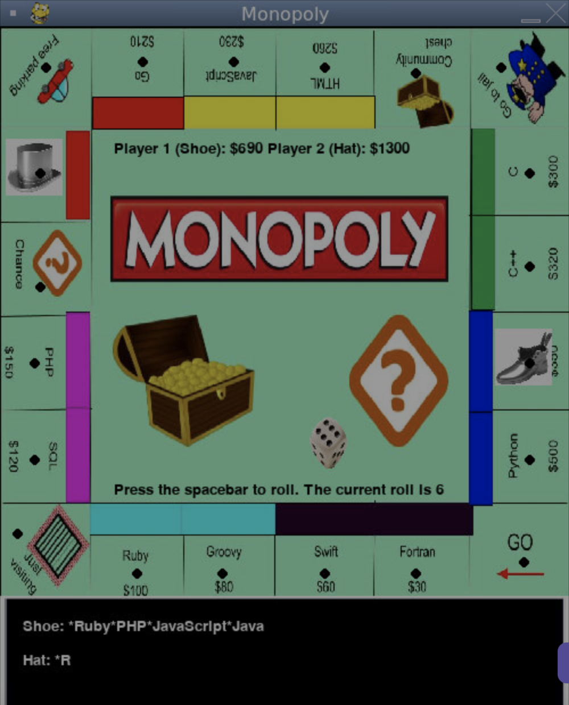
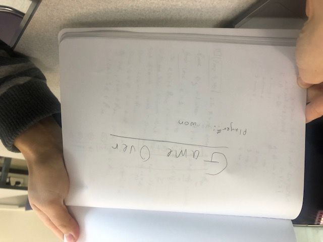
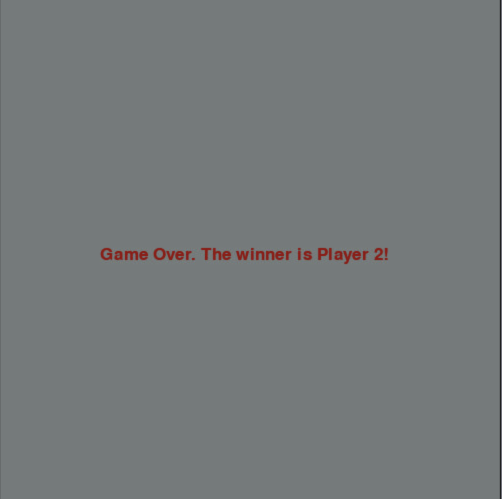
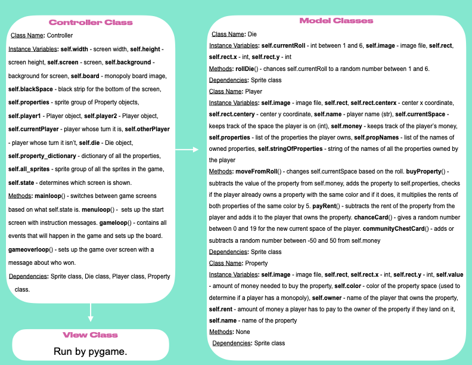

warning: Everything between << >> needs to be replaced (remove << >> after replacing)
# CS110 Project Proposal
# Computer Science Monopoly
## CS 110 Final Project
### Spring, 2022 
### [Assignment Description](https://docs.google.com/document/d/1H4R6yLL7som1lglyXWZ04RvTp_RvRFCCBn6sqv-82ps/edit#)

<< [repl](#)>>
[github repo:](#) https://github.com/bucs110a0spring22/final-project-the-mathletes.git
<< [link to demo presentation slides](#) >>

### Team: The Mathletes
####  Ryan Renda, Lauren Stiefel, Aviva Friedman 

***

## Project Description *(Software Lead)*

 This program is a functioning computer science themed Monopoly. All of the properties have a name that is a language of computer science. It allows two players to move their pieces around the board and buy properties with the goal of bankrupting the other player. When a player lands on a property that wasn't previously landed on, the game forces them to buy the property and subtracts the amount of the property from their money total. They are now considered the owner of that property, and when the other player lands on it, they are forced to pay rent to the owner. When a player owns both properties of the same color, known as a monopoly, the rent increases to 5 times the original value. When either player lands on go, they recieve $200 and when they land in the 'go to jail' space they are transported to jail and lose some money. The community chest pays or subtracts a randomly generated amount of money to the player that lands on it and the chance space moves the player to a random location to somewhere else on the board. The game ends when one player loses all their money or if the players choose to end the game. When the game is over the program displays which player wins based on how much money remains in their account. 

***    

## User Interface Design *(Front End Specialist)*

* << A wireframe or drawing of the user interface concept along with a short description of the interface. You should have one for each screen in your program. >>
    * For example, if your program has a start screen, game screen, and game over screen, you should include a wireframe / screenshot / drawing of each one and a short description of the components
    * Origional start screen design - 
    * Final start screen design - instructions for starting and quitting the game
    * Original game screen design -  
    * Final game screen design - monopoly game board which includes the game pieces (hat and shoe) and message box that shows the properties that each player owns.
    * Original game over screen design
    * Final game over screen design - tells you who won the game

***        

## Program Design *(Backend Specialist)*

* Non-Standard libraries
    * pygame
      * https://www.pygame.org/docs/
      * This module is allows the programmer to create graphics and respond to user events in the GUI.

* Class Interface Design

   *  

* Classes
    * Die - Class that defines a die. Keeps track of the current roll of the die and has the rollDie() method, which "rolls" a six sided die.
    * Player - Class that defines a player. This includes the image for the player, the amount of money it has, its location, and the properties it owns. Methods - moveFromRoll(), buyProperty(), chanceCard(), communityChestCard(), payRent()
    * Property- Class that defines a property. This keeps track of a property's name, the amount of money it costs to buy, its rent, and its owner. The image is just a dot used to show the location that the player will go to when it moves to that property. Methods - addMoney(), subtractMoney(), transferMoney(), bankrupt()
    * Controller - Class that defines the controller. It creates the Player and Die objects, and creates the Property objects by reading a JSON file (data permanence feater) - this make it easier to change instance variable for the properties. Methods - mainloop(), menuloop(), gameloop(), gameoverloop()
## Project Structure *(Software Lead)*

The Project is broken down into the following file structure:

* main.py
* src
    * <all of your python files should go here>
* assets
    * <all of your media, i.e. images, font files, etc, should go here)
* etc
    * <This is a catch all folder for things that are not part of your project, but you want to keep with your project. Your demo video should go here.>

***

## Tasks and Responsibilities *(Software Lead)*

   * You must outline the team member roles and who was responsible for each class/method, both individual and collaborative.

### Software Lead - << Lauren >>

<< Worked as integration specialist by... >>

### Front End Specialist - << Ryan >>

<< Front-end lead conducted significant research on... >>

### Back End Specialist - << Aviva >>

<< The back end specialist... >>

## Testing *(Software Lead)*

* << Describe your testing strategy for your project. >>
    * << Example >>

## ATP

| Step                  | Procedure     | Expected Results  | Actual Results |
| :----------------------:|:-------------:| :-----------------:| -------------- |
|  1  | Click Run Button | Screen appears with "computer science monopoly" and game instructions  |          |
|  2  | press 'q' key  | program ends 
|  3  | press 'spacebar'  | screen changes to monopoly board  |          |
|  4  | press 'spacebar'  |  player 1 - (shoe picture) jumps foward between 1 and six spaces to a property. If it is an unowned property and the player has enough money to buy it, it is automatically bought (the value of the property is subtracted from the player's money). If property is owned by the other player the rent of the property is subtracted from the player's money and added to the other player's money. If the player lands on go, their money increases by $200. If they land on community chest, their money increases or decreases by a random number from -50 to 50. If they land on chance, the player moves to a random space on the board. If they land on 'go to jail,' $50 is subtracted from their money and they move to just visiting space. If they land on 'free parking' or 'just visiting,' nothing happens. If a player has $0 or less, a game over screen appears with the player that won (the player with the most money) and the amount of money they ended the game with. 
|  5  | press 'spacebar'  | the same actions are repeated with player 2.  |          |
|  6  | 'q' is pressed  |  game over screen appears with the player that won (player with the most money) and the amount of money they have |
|  7  | Click stop button (on the repl)  |  program ends |

